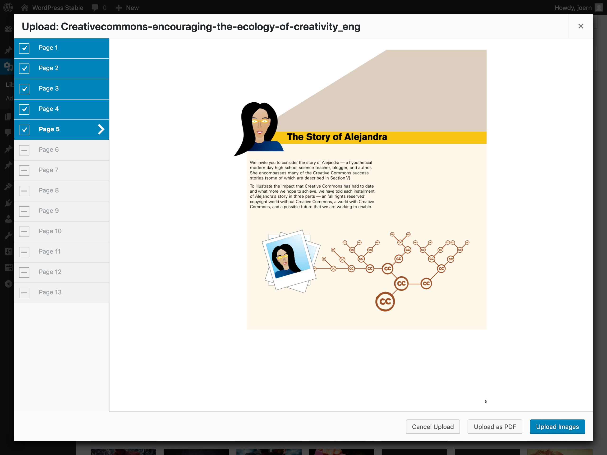

PDF Renderer
============

Convert PDF Files to Images in your browser when dropped into the media library.

Includes [Mozilla pdf.js](https://github.com/mozilla/pdf.js/) for browser pdf rendering.
 

PDF-Contents: cc-by [Creative Commons](https://creativecommons.org/)

Installation
------------

### Production
 - Head over to [releases](../../releases)
 - Download 'pdf-renderer.zip'
 - Upload and activate it like any other WordPress plugin
 - AutoUpdate will run as long as the plugin is active

#### Using composer
```
composer require mcguffin/pdf-renderer
```

### For Development
 - cd into your plugin directory
 - $ `git clone git@github.com:mcguffin/pdf-renderer.git`
 - $ `cd pdf-renderer`
 - $ `npm install`
 - $ `npm run dev`

Plugin API
----------

### Filter `pdf_renderer_image_width`

Use this to overrule width of generated images. Uses the largest image width known to WP by default. (e.g. the Large size from Settings > Media).

#### Example:
```php
add_filter( 'pdf_renderer_image_width', function( $width ) {
	// never underestimate a good integer.
	return 12345;
});
```

### Filter `pdf_renderer_image_type`

Type of generated images. Possible values are `image/png` and `image/jpeg`. default is `image/png`.  
To override the JPEG-Quality you can use the WP Core filter `jpeg_quality`. The string `pdf_renderer` is passed as a second argument to `apply_filters()`.

#### Example:
```php
// we want jpeg ...
add_filter( 'pdf_renderer_image_type', function( $type ) {
	return 'image/jpeg';
});
// ... and a specific treatment for PDFs.
add_filter( 'jpeg_quality', function( $quality, $context = '' ) {
	if ( 'pdf_renderer' === $context ) {
		// Everybody loves artifacts.
		return 1;
	}
	return $quality;
}, 10, 2);
```

Development
-----------
npm scripts:

 - `npm run audit`: Run phpcs audit
 - `npm run build`: Build css and js from sources
 - `npm run dev`: Watch css and js source dirs
 - `npm run dashicons`: Generate dashicons scss variables from source
 - `npm run i18n`: generate `.pot` file
 - `npm run rollback`: remove last commit (local and remote  – use with caution!)
 - `npm run test`: run unit tests against PHP 7.4 and 8.3
 - `npm run test:edge`: run unit tests against PHP 8.3 only
 - `npm run test:legacy`: run unit tests against PHP 7.4 only

Testing
-------
### Unit Tests
Unit tests are run in [wordpress/env](https://www.npmjs.com/package/@wordpress/env/v/2.0.0), which is basically a docker container. [Docker Desktop](https://docs.docker.com/desktop/) is required.

Unit tests are run against PHP 7.4 (legacy) and 8.3 (edge).  

**Run them all:**
```shell
npm run test
```

**Run edge tests only:**
```shell
npm run test:edge
```

**Configure edge test and run something in wp-cli in the docker container:**
```shell
npm run test:set-edge
npm run test:reset-env
wp-env run cli wp core version
> 6.7.1
```
